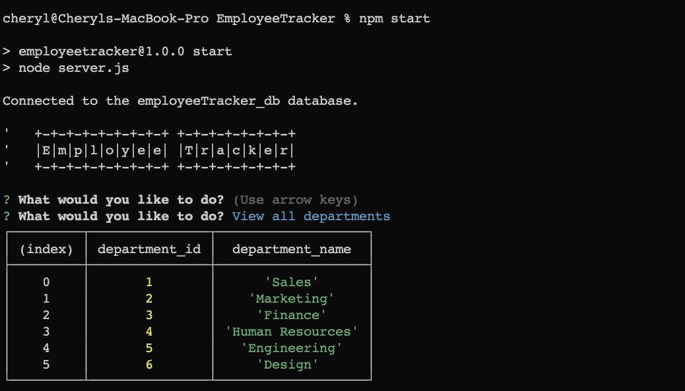
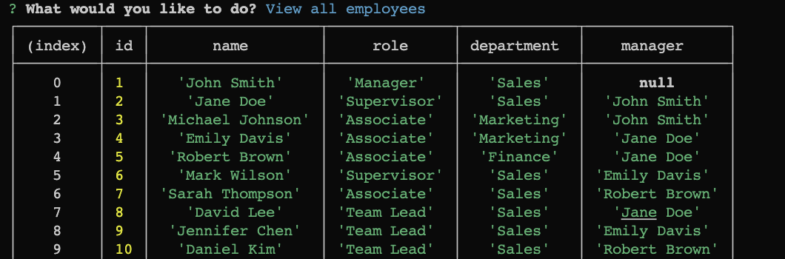
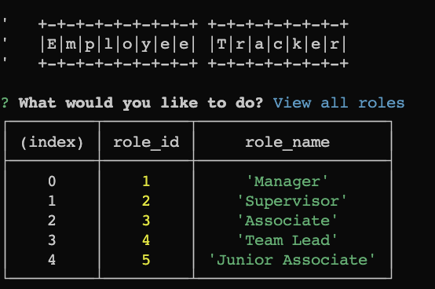

# Employee Tracker
A command-line app that allows users to view departments, roles, employees, salaries etc and edit or add same. Uses Inquirer to capture answers, but I quit once I got the MySQL to work because I think spending tons of time learning Inquirer is a waste of time.
## Table of Contents 

- [Installation](#installation) 

- [Usage](#installation)

- [Contributions](#installation)
- [Tests](#installation)

- [Questions](#installation)

## Installation
Install Node packages, type 'node index.js' to start app.
## Usage

View Departments

View Employess

View Roles

## Contributing
Feel free to clone and and use freely.

## Tests
No tests included

## Questions
Contact [Cheloe](https://github.com/Cheloe) at [cheryl.loeffler@gmail.com](mailto:cheryl.loeffler@gmail.com)

## License
<a href ="https://choosealicense.com/licenses/mit/"> MIT License</a>

